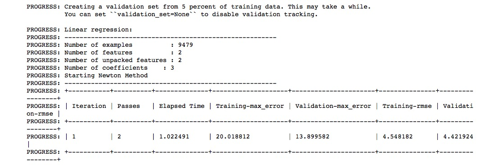

##Machine Learning with Graphlab
###Linear Regression

import graphlab and load data

```python
import graphlab
data = graphlab.SFrame.read_csv("Downloads/MachineLearning-master/Example Data/OLS_Regression_Example_3.csv")
```

Set visualize target to ipython notebook

```python
graphlab.canvas.set_target("ipynb")
```

Replace Us metrics with cm and kilo's

```python
height_transform = lambda x:x * 2.54
weight_transform = lambda x:x * 0.45359237
data['Height'] = height_transform(data['Height'])
data['Weight'] = weight_transform(data['Weight'])
```

Visulize:

```python
data.show(view="Scatter Plot", x = "Height", y = "Weight")
```


Train a linear regression model

```python
lm_model = graphlab.linear_regression.create(data, target="Weight", features=['Gender', 'Height'])
```

we can get that rmse = 4.54
predict weight based on male, height 170, female 170
firstly construct a SFrame

```python
predict_data = graphlab.SFrame({'Gender':['Male','Female'], "Height":[170,170]})
```



Predict based on data

```python
lm_model.predict(predict_data)
```


###KNN

Firstly, import graphlab library and load data:

```python
import graphlab
knn_data = graphlab.SFrame.read_csv("/Users/wbcha/Downloads/MachineLearning-master/Example Data/KNN_Example_1.csv")
```

Split data into train_data and test_data (2-fold):

```python
train_data, test_data = knn_data.random_split(0.5)
```

Train a k nearest neighbour model:

```python
knn_model = graphlab.nearest_neighbors.create(train_data, features=['X', 'Y'], label='Label', distance='euclidean')
```

Model summary:

```python
knn_model.summary()
```

Predict for test data and an unknownpoint:

```python
res = knn_model.query(test_data, label= 'Label', k = 3)
```

The predict result and distance can be visualized on Ipythonnotebook. Column *query_label* and *reference_label* represent predicted result and label of test_data respetively.


Make a unknown point with *Graphlab SFRAME* and evaluate:

```python
queries = graphlab.SFrame({'X': [5.3], 'Y': [4.3]})
knn_model.query(queries)
```

From result we can see that point [5.3,4.3] was predicted as 0 in 4 out of 5 times.


