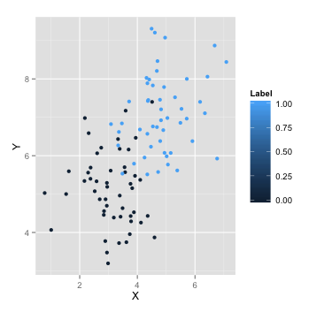
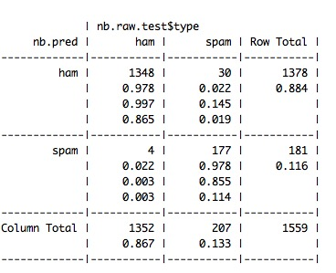
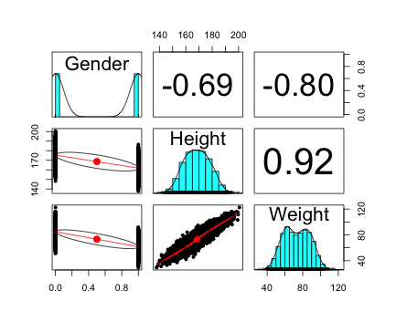
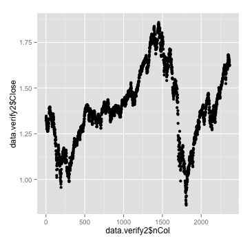
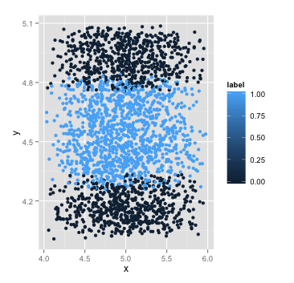
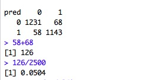
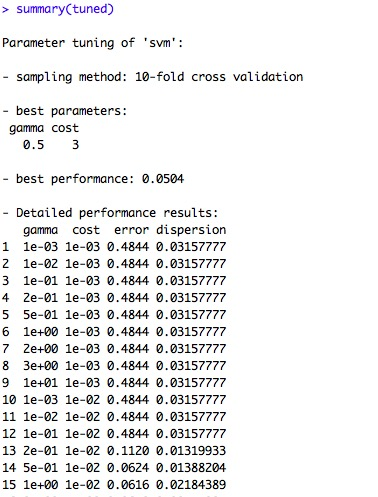
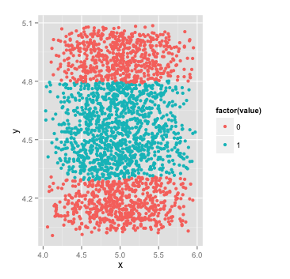
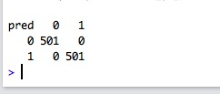
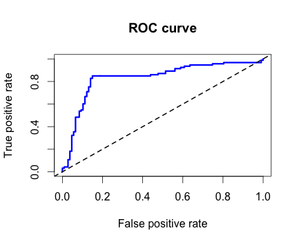

#Machine Learning with R

##Index

* [Overview of ML with R](#R-Machine-Learning)
* [Implement ML with R](#R-Machine-Learning)
* [Model Evaluation](#ML-Tricks-With-R)
* [Combine with High Order Functions](#R-Functional)

<h2 id='R-Machine-Learning-Overview'>R Machine Learning Overview</h2>


As a free, open-source, statistical language, R is today one of the most attracting tool for both developers and data scientists to use. Most machine-learning algorithms are not included as part of the base installation, but thanks for thounds of contributors from varies communities, a bunch of packages was added as a supplement in R. Packages was free to download from [CRAN](https://cran.r-project.org/) with only one line of code:

```r
install.packages("package_name")
```

If we need to use one additional package, only need import with one line of code:

```r
library(package_name)
```

Different R data wrangling, machine learning and plotting packages made it extremely handy and powerful for everyone. In this project, we mainly covered these packages:

Data wrangling packages:

+ Basic R commands
+ dplyr
+ plyr
+ reshape
+ reshape2
+ xlsx

Machine Learning Packages:

+ caret
+ e1071
+ kernlab
+ class
+ tm
+ stats

Visualization Package:

+ ggplot2
+ wordcloud
+ psych

<h2 id='R-Machine-Learning'>Implement Machine Learning</h2>

###Nearst Neighbour

Nearest neighbor classifiers are defined by their characteristic of classifying unlabeled examples by assigning them the class of the most similar labeled examples, and well-suited for classification tasks. Two things we need to specificy

1. the number of k, one common practice is to set k equal to the square root of the number of training
examples
2. the distance metric to use, eculidean distance, manhattan distance etc.

First step, load data from CSV

```r
knn.data <- read.csv("Downloads/MachineLearning-master/Example Data/KNN_Example_1.csv")
```

Visualize what the data looks like:

```r
library(ggplot2)
ggplot(knn.data) + geom_point(aes(X, Y, color = Label))
```



In the plot, blue and red points mixed in the area *3<x<5* and *5<y<7.5*. From Mike's blog:

>Since the groups are mixed the K-NN algorithm is a good choice, as fitting a linear decision boundary would cause a lot of false classifications in the mixed area.

Firstly, split data into train and test data with:

```r
sub <- sample(2, nrow(knn.data), replace=TRUE, prob=c(0.5, 0.5))
data.train <- knn.data[sub == 1, 1:2]
data.test <- knn.data[sub == 2, 1:2]
data.train.label <- knn.data[sub == 1, 3]
data.test.label <- knn.data[sub == 2, 3]
```

Train a knn model

```r
library(class)
knn.pred <- knn(train = data.train, test = data.test, cl = data.train.label, k = 3)
```

Compare the predict data and real label of test data:

```r
knn.pred.dataframe <- as.data.frame(knn.pred)
knn.test.label <- as.data.frame(data.test.label)
knn.accuracy <- cbind(knn.pred.dataframe, knn.test.label)
```

Predict a unknown point(5.3,4.3)

```r
d1 <- 5.3
d2 <- 4.3
unknown <- cbind(d1, d2)
colnames(unknown) <- c("X", "Y")
knn.pred <- knn(train = data.train, test = unknown, cl = data.train.label, k = 3)
```

Result is 0.

We can also apply *feature scaling* on this data, by applying a function named *normalize*:

```r
normalize <- function(x){
	return ((x - min(x)) / (max(x) - min(x)))
}
```

Here we need to apply this normalize function to our data by using function *lapply*, this function is a high-order function which taks an dataframe as the first parameter, and a function as the second parameter.

```r
knn.data.scaled <- as.data.frame(lapply(knn.data[1:2], normalize))
```

The rest steps is just the same as before.

Evaluate the classifier:

```r
library(gmodels)
CrossTable(x = knn.accuracy$data.test.label, y = knn.accuracy$knn.pred, prop.chisq = F)
```

The result is a *confusion matrix* like this:


As figure show above, 2 out of 51 points are misclassified, 96.08% seems to be an resonable result for an un-improved knn classifier.

###Naive Bayes

**Naive Bayes** is an algorithm that use principles of probability for classification. For example, use frequency of words in junk email messages to identify new junk email. We mostly use **naive bayes** to estimate the likelihood of an event should be based on the evidence.

Naive Bayes is simple to use, fast, effective, does well with missing values and require not so much training example. However, it makes an *naive* assumption about the distribution as this algorithm treats each feature equally important and independent. This is not likely to be always true in the real-world applications.

In this section, as we need to build a model based on *text analysis*, we need these packages:

```r
library(tm)
library(wordcloud)
library(e1071)
library(gmodels)
```

**tm** is for text clean and generate DTM, **wordcloud** can help us make wordcloud plot. **e1071** has built in naivebayes classifier and gmodels allow us to evaluate the model performance.

The main steps of using R for build a naive bayes classifier is listed:

After load data into R, we need to remove stop words, white spaces, numbers and punctuation with these lines of code:

```r
nb.corpus <- tm_map(nb.corpus, removeNumbers)
nb.corpus <- tm_map(nb.corpus, removeWords, stopwords())
nb.corpus <- tm_map(nb.corpus, removePunctuation)
nb.corpus <- tm_map(nb.corpus, stripWhitespace)
```

For build a **DocumentTermMatrix**, we just need to call *DocumentTermMatrix* function in **tm** package:

```r
nb.dtm <- DocumentTermMatrix(nb.corpus)
```

To visualize wordcloud, we need use **wordcloud** library:

```r
wordcloud(spam$text, max.words = 40, scale = c(3, 0.5))
wordcloud(ham$text, max.words = 40, scale = c(3, 0.5))
```

The result is like this, first chart is wordcloud of spam messages, second chart is wordcloud of ham messages:


Train a classifier and make prediction:

```r
nb.classifier <- naiveBayes(nb.train, nb.raw.train$type)
nb.pred <- predict(nb.classifier, nb.test)
```

Evaluate the classifier performance:

```r
CrossTable(nb.pred, nb.raw.test$type, prop.chisq = FALSE)
```



From the confusion matrix we are able to know that 13% of the email is labeled as spam, in which 34 observations were misclassified, and the precision rate is 97.82%.

####Linear Regression

Regression analysis is used for modeling relationships among data element and try to estimate the impact of one feature related to the outcome.

In this section, we mainly focus on the most simple regression work named **linear regression**, try to fit a line to evaluate the realtionship between sexual, weight and height.

Read data:

```r
data <- read.csv("Downloads/MachineLearning-master/Example Data/OLS_Regression_Example_3.csv", stringsAsFactors=F))
```

Replace gender feature with 1 and 0, 1 represents Female, 0 represents Male.

```r
data$Gender[which(data$Gender=="Male")] = 0
data$Gender[which(data$Gender=="Female")] = 1
```

Replace Us metrics with cm and kilo's

```r
data$Height = data$Height * 2.54
data$Weight = data$Weight * 0.45359237
```

Plot weight and height for human:

```r
library(ggplot2)
human.plot <- ggplot(data)
human.plot + geom_point(aes(x = Height, y = Weight)) + labs(title = "Weight and heights for male and females")
```


Plot weight and height for male and female:

```r
maleFemale.plot <- ggplot(data)
maleFemale.plot + geom_point(aes(x = Height, y = Weight, color = Gender)) + labs(title = "Weight and heights for male and females")
```


Also, we can check the relationships between 3 variables,  It provides a visualization of how strongly correlated the variables are. 

```r
library(pshch)
pairs.panels(data[c("Gender", "Height", "Weight")])
```



train a linear model(ignore male and female difference)

```r
lm_model <- lm(Weight~Gender+Height, data=data)
summary(lm_model)
```

By summary, we can get the Model ERROR:

*Residual standard error: 4.542 on 9997 degrees of freedom*

Predict weight base on male, height = 170:

```python
test.data <- data.frame(0, 170)
colnames(test.data) <- c("Gender", "Height")
test.data$Gender <- as.factor(test.data$Gender)
predict(lm_model, test.data)
```

Result is 74.1459.

Predict weight base on female, height = 170

```python
test.data <- data.frame(1, 170)
colnames(test.data) <- c("Gender", "Height")
test.data$Gender <- as.factor(test.data$Gender)
predict(lm_model, test.data)
```

Result is 70.3558.

###Principle Component Analysis

Load data:

```r
data <- read.csv("Downloads/MachineLearning-master/Example Data/PCA_Example_1.csv", stringsAsFactors=F)
data$Date = as.Date(data$Date)
```

Transform data structure into Date, Stock1, Stock2...(group by date):

```r
data <- reshape(data, idvar = "Date", timevar = "Stock", direction = "wide")
```

Sort data by date:

```r
data <- arrange(data, Date)
```

Train a principle model:

```r
pca.model = prcomp(data[,2:ncol(data)])
PC1 <- pca.model$x[,"PC1"]
```

Add a date duration column for data visualization:

```r
duration <- 1:nrow(PC1)
PC1 <- as.data.frame(PC1)
duration <- as.data.frame(duration)
PC1 <- cbind(PC1, duration)
colnames(PC1) <- c("feature", "duration")
```

Visualize data:

```r
pc1_plot <- qplot(PC1$duration, PC1$feature)
```


The data in plot is exactily the same as Mike's blog, but the sequence is a bit different.

Verify data:

```r
#verify data path
data.verify <- read.csv("Downloads/MachineLearning-master/Example Data/PCA_Example_2.csv", stringsAsFactors = F)
data.verify$Date <- as.Date(data.verify$Date)
#subset data, only contains 2 columns, date and close
data.verify <- data.verify[,c(1,5)]
#sort by date
data.verify <- arrange(data.verify, Date)
#add duration
duration.verify <- 1:nrow(data.verify)
duration.verify <- as.data.frame(duration.verify)
data.verify <- cbind(duration.verify, data.verify)
qplot(data.verify$duration.verify, data.verify$Close)
```

Un-normalized:


Normalized:



###Support Vector Machine

Firstly, read data from csv:

```r
train.data <- read.csv("Downloads/MachineLearning-master/Example Data/SVM_Example_1.csv", stringsAsFactors=F)
```

Take a look at our data:



Linear classifier will not work. Instead, we use SVM & Guassian Kernel.

In order to train a svm classifier, we need to transform label feature to type *factor*, and install package *e1071*.

```r
install.packages("e1071")
library(e1071)
train.data$label <- as.factor(train.data$label)
```

Train a simple svm classifier:

```r
model <- svm(label~., data = train.data)
```

Make predict:

```r
pred <- predict(model, train.data[,1:2])
table(pred, train.data[,3])
```

We can infer the error percentage from this step, 126 points are mis-classified.



Now try to train a best svm classifier with different *sigma* and *cost*.

```r
sigma <- c(0.001, 0.01, 0.1, 0.2, 0.5, 1.0, 2.0, 3.0, 10.0)
cost <- c(0.001, 0.01, 0.1, 0.2, 0.5,1.0, 2.0, 3.0, 10.0, 100.0)
tuned <- tune.svm(label~., data = train.data, gamma = sigma, cost = cost)
summary(tuned)
```



Turend function tell us the best sigma/cost pair should be 0.5/3.

With these parameters, we are able to train a new classifier

```r
model.new <- svm(label~., data = train.data, gamma = 0.5, cost = 3)
```

Combine predict result and original data:

```r
df <- cbind(train.data, data.frame(ifelse(as.numeric(predict(model.new))>1,1,0)))
colnames(df) <- c("x", "y", "label", "predict")
```

Remove *label* column:

```r
df <- df[,c(1,2,4)]
```

Transform data:

```r
predictions <- melt(df, id.vars = c("x", "y"))
```

And visualize:

```r
ggplot(predictions, aes(x, y, color = factor(value))) + geom_point()
```



Compare original with svm-classified data:


Reference:

1. [Data Mining Algorithms In R/Classification/SVM](https://en.wikibooks.org/wiki/Data_Mining_Algorithms_In_R/Classification/SVM)
2. [ML for hakers](https://github.com/johnmyleswhite/ML_for_Hackers/blob/master/12-Model_Comparison/chapter12.R)
3. [SVM example with Iris Data in R](http://rischanlab.github.io/SVM.html)
4. [Multiple graphs on one page (ggplot2)](http://www.cookbook-r.com/Graphs/Multiple_graphs_on_one_page_(ggplot2)/)

###Support Vector Machine -- Polynomial Kernel

Fisrt, take a look of our train & test data:

```r
train.data = read.csv("Downloads/MachineLearning-master/Example Data/SVM_Example_2.csv", stringsAsFactors = F)
test.data = read.csv("Downloads/MachineLearning-master/Example Data/SVM_Example_2_Test_data.csv", stringsAsFactors = F)
ggplot(train.data) + geom_line(aes(x = x, y = y, color = factor(label)))
ggplot(test.data) + geom_line(aes(x = x, y = y, color = factor(label)))
```


Use *polynomial* model:

```r
model <- svm(label~., data = train.data, kernel = "polynomial", degree = 3)
pred <- predict(model, train.data[,1:2])
table(pred, train.data[,3])
```

turn model with best gamma and cost:

```r
sigma <- c(0.001, 0.01, 0.1, 0.2, 0.5, 1.0, 2.0, 3.0, 10.0)
gamma <- 1/(sigma * sigma *2)
cost <- c(0.001, 0.01, 0.1, 0.2, 0.5,1.0, 2.0, 3.0, 10.0, 100.0)
tuned <- tune.svm(label~., data = train.data, gamma = gamma, cost = cost)
summary(tuned)
```

We are able to know that best performance(minimum error) is 0.



###K-means in R

**Clustering** is an unsupervised machine learning task that automatically divides the data into clusters, the idea of grouping is the same: group the data such that related elements are placed together.

One problem of k-means is that it may stuck at local minimum instead converge at the global minimum, so run k-means clustering several times may be a good choice. How to decide the number of groups?

1. Prior knowledge of the data.
2. Elbow method, to choose the elbow point in the graph.

We use *SNS Dataset* for this clustering task:

```r
data <- read.csv("Desktop/Q1 Course/FP/MachineLearningSamples/extra-data/snsdata.csv", header = T)
```

If we take a look at our data, we can find that there are many missing values exist:

```r
sapply(data, function(x) sum(is.na(x)))
```

By applying *sun(is.na)*, we calculated number of missing value in each column. There are 2724 missing values in *gender* column and 5086 in *age* column.

Firstly, we use dummy coding to treat gender values by create 2 new columns named *female* and *no_gender*:

```r
data$female <- ifelse(data$gender == "F" & !is.na(data$gender), 1, 0)
data$no_gender <- ifelse(is.na(data$gender), 1, 0)
```

Then impute missing values of age column:

```r
ave_age <- ave(data$age, data$gradyear, FUN = function(x) mean(x, na.rm = TRUE))
data$age <- ifelse(is.na(data$age), ave_age, teens$age)
```

If the age if NA, we'll impute current age with mean value age of graduation year.

Train a model:

```r
library(stats)
data <- data[, -2]
sns_model <- kmeans(data, 5)
```

Now we've built a k-means model with R.


<h2 id='ML-Tricks-With-R'>Model Evaluation</h2>

In this section, we are going to introduce how to evaluate an algorithm using R.

###Confusion Matrix

A **Confusion Matrix** is a table that categorize predictions and it's real class. In previous, we've used this metric to evaluate our classifier using this line of code:

```r
library(gmodels)
CrossTable(predict_type, original_type, prop.chisq = False)
```

A **Confusion Matrix** contains 4 parts in general:

+ True Positive, correctly classified with class to be expected.
+ True Negative, correctly classified with class not expected.
+ False Positive, misclassified with the class of expected.
+ False Negative, misclassified with the class not expected.

And with this matrix, we are able to calculate the final accuracy rate.

Besides of function **CrossTable**, in R we can also use:

```r
table(original_type, predicted_type)
```

to build a **confusion matrix** manually.

###Precision and Recall

This measure is able to provide an indication of how interesting and relevant a model's result are.

**Precision** is the percentage of positive values that are truely positive, that is, precision equals the number of true positive divide the sum of true positive and false positive.

On the ohter hand, **Recall** indicates how complete the result are, that is the number of true positive over the sum of true positive and false negative.

We can calculate this measure by two ways, manually or use package *caret*. According to the confusion matrix we listed before, it is not hard for us to get the number of TP, TF, NP and NF, what we need to do is just to plug-in these values into the Precision/Recall fomular. Another way is like this:

```r
library(caret)
posPredValue(predit_type, original_type, positive = "label_of_positive_type")
```

###F-Score

As it seems to be a bit messy if we use both **Precision** and **Recall**, **F-Score** is a combination of these two metrics into a single number.

```r
F-Score = (2 * precision * recall)/(precision + recall)
```

F-measure reduces model performance to a single number, it provides a convenient way to compare several models side-by-side.

###Cross Validation

Our data is not fixed and comes from a random distribution, our model learn from our data, and give us the learned result by the sample data. If we train model based on all data and evaluate model based on the same set, we may end up with over optimistic prediction. So there must exists a set for us to evaluate the model and this set need to be statistically independent.

Varies packages in R allow us using a number of functions for this purpose.

####Hold Out

Except train set and test set, a third dataset need to be seperated named *cross validation set*. It is suggested that:

> The validation dataset would be used for iterating and refining the model or models
chosen, leaving the test dataset to be used only once as a final step to report an estimated error rate for future predictions. 

There also exists some limitations when we use *hold out*. For example, suppose we have not so much training examples, the propotation of hold out may lead to an un-reliable model.

In R, we mostly generate a random id for observations then construct three part of dataset by filter different id.

####K-Fold-Crossvalidation

K-fold cross validation is a commonly used technique for validate model performance. We first divide data into k folds, and each of the k folds takes turns being the hold-out validation set; a model is trained on the rest of the k 1 folds and measured on the held-out fold. 10-fold cross validation is often used.

This function is already built in *caret package*:

```r
folds <- createFolds(data, k = 10, list = False)
str(folds)
```

####Leave-One-Out

Leave-One-Out is another cross validation technique which always test one single object. LOOCV is essentially the same as K-fold cross validation. This method maxmized train data and cv data, but in some situation, it may be computational expensive.

LOOCV and be done using package *DMwR*, but I didn't implement it myself.

###ROC Curve

The ROC curve (Receiver Operating Characteristic) is commonly used to examine
the tradeoff between the detection of true positives while avoiding false positives.

The closer the curve is to the perfect classifier, the area under the ROC Curve is larger (named AUC).

In R, we use **ROCR** package to plot ROC Curve.

An example:

```r
library(ROCR)
data(ROCR.simple)
pred <- prediction(ROCR.simple$predictions,ROCR.simple$labels)
pref <- performance(pred, measure = "tpr", x.measure = "fpr")
plot(pref, main = "ROC curve for SMS spam filter", col = "blue", lwd = 3)
abline(a = 0, b = 1, lwd = 2, lty = 2)
```

Result:



<h2 id='R-Functional'>R Functional</h2>

As Hadley Wickham said that

> R, at its heart, is a functional programming (FP) language.

Here is a few examples on how we combine R with high-order funcitons:

In **Knn**, we implemented *feature scaling* with this line of code:

```r
normalize <- function(x){
	return ((x - min(x)) / (max(x) - min(x)))
}
knn.data.scaled <- as.data.frame(lapply(knn.data[1:2], normalize))
```

Here, lapply function taks an function named *normalize* as an argument, returns an matrix, then we transforma it into a dataframe.

In **Naive Bayes**, in order to build a classifier, we need to transform all factor values from 0, 1 to No, Yes, we accomplish by applying a function into another function like this:

```r
convert_counts <- function(x) {
    x <- ifelse(x > 0, 1, 0)
    x <- factor(x, levels = c(0, 1), labels = c("No", "Yes"))
    return(x)
}
nb.train <- apply(train.data, MARGIN = 2, convert_counts)
nb.test <- apply(test.data, MARGIN = 2, convert_counts)
```

Here, firstly, we built a function named **convert_counts**, then, by using **apply** function in R, we apply **convert_counts** function to both train.data and test.data.

In **K-means**, as we need to handle with missing values, firstly, we used function *sapply* to check which column has missing vaues:

```r
sapply(data, function(x) sum(is.na(x)))
```

We used these lins of code for imipute missing values:

```r
ave_age <- ave(data$age, data$gradyear, FUN = function(x) mean(x, na.rm = TRUE))
data$age <- ifelse(is.na(data$age), ave_age, teens$age)
```

Firstly, we use an **anonymous function** to get the mean value of each class of gradyear, then each time a missing value is found, we call the ave function to impute the missing value.
