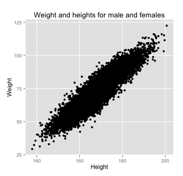

###Machine Learning with R

####Linear Regression

Read data:

```r
data <- read.csv("Downloads/MachineLearning-master/Example Data/OLS_Regression_Example_3.csv", stringsAsFactors=F))
```

Replace gender feature with 1 and 0, 1 represents Female, 0 represents Male.

```r
data$Gender[which(data$Gender=="Male")] = 0
data$Gender[which(data$Gender=="Female")] = 1
```

Replace Us metrics with cm and kilo's

```r
data$Height = data$Height * 2.54
data$Weight = data$Weight * 0.45359237
```

Plot weight and height for human:

```r
library(ggplot2)
human.plot <- ggplot(data)
human.plot + geom_point(aes(x = Height, y = Weight)) + labs(title = "Weight and heights for male and females")
```



Plot weight and height for male and female:

```r
maleFemale.plot <- ggplot(data)
maleFemale.plot + geom_point(aes(x = Height, y = Weight, color = Gender)) + labs(title = "Weight and heights for male and females")
```


train a linear model(ignore male and female difference)

```r
lm_model <- lm(Weight~Gender+Height, data=data)
summary(lm_model)
```

By summary, we can get the Model ERROR:

*Residual standard error: 4.542 on 9997 degrees of freedom*

Predict weight base on male, height = 170:

```python
test.data <- data.frame(0, 170)
colnames(test.data) <- c("Gender", "Height")
test.data$Gender <- as.factor(test.data$Gender)
predict(lm_model, test.data)
```

Result is 74.1459.

Predict weight base on female, height = 170

```python
test.data <- data.frame(1, 170)
colnames(test.data) <- c("Gender", "Height")
test.data$Gender <- as.factor(test.data$Gender)
predict(lm_model, test.data)
```

Result is 70.3558.


